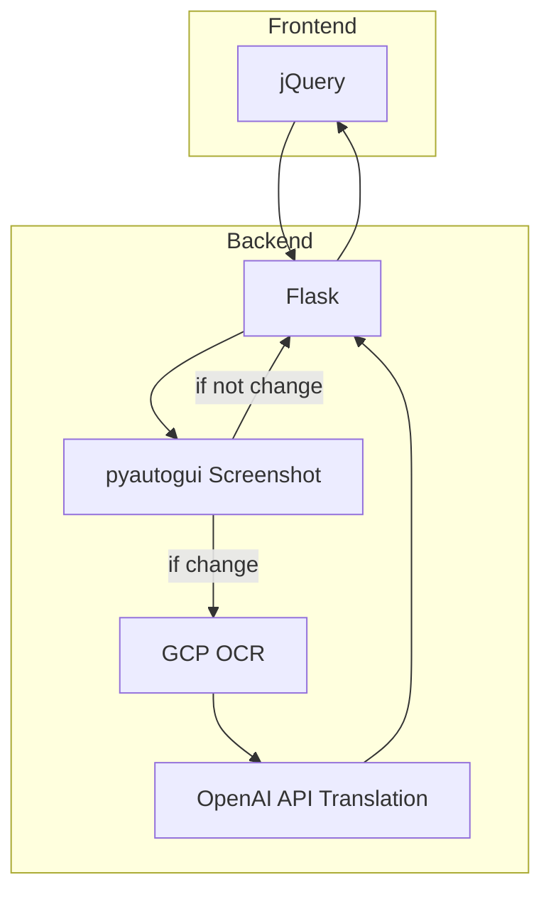

# demo

## point
- 2秒に一回、スクリーンショットを撮る
- 変化の検知は、
  - グレースケール化して白と黒の割合を計算
  - 一つ前のスクリーンショットと比較し、閾値以上の差があるかを見る
- OCRはgoogleのapiサービスを利用 (https://cloud.google.com/vision/docs/ocr)
- 翻訳は、OpenAI APIのgpt-4.1-nanoを使用
